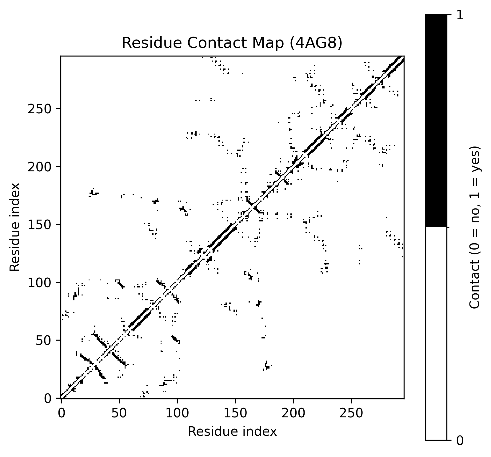

# Structural PDB Analyzer (Learning Project)

This project is a Python tool to analyze basic structural information from PDB files.

---

## Overview

This project performs structural analysis of proteins from PDB files, including:

- Parsing ATOM and HETATM records  
- Residue extraction and classification  
- Residue contact map generation  
- Solvent Accessible Surface Area (SASA) calculation
- Relative SASA and residue exposure classification
- Comparative analysis of multiple proteins  

The main objective was to implement core structural bioinformatics concepts manually to strengthen Python programming skills.

---

## What This Project Does (So Far)

### 1. Residue Analysis

- Counts atoms and residues  
- Classifies residues into:
  - Hydrophobic  
  - Polar  
  - Charged  
- Computes residue composition per chain  

### 2. Contact Map

- Atom–atom distance calculation  
- Residue–residue contact detection (cutoff-based)  
- Binary contact matrix visualization  

### 3. SASA Calculation

- Implemented using the Shrake–Rupley algorithm via Bio.PDB  
- Per-residue SASA values (Ų)
- Relative SASA normalization using residue-specific reference values
- Residue exposure classification:
  - Buried (< 0.2)
  - Intermediate (0.2–0.5)
  - Exposed (> 0.5)
- Summary of exposure distribution across the protein

---

## Project Structure

```

utils.py
contact-map.py
single-protein-analyzer.py
multiple-protein-analyzer.py
sasa.py
data/

```

---

## Example Output

- Residue class bar plot  
- Binary contact map  

- CSV summary file  
- Total and per-residue SASA values  
- Relative SASA and exposure classification
---

## Notes

- The focus is educational.  
- Simplified biochemical grouping for didactic purposes; therefore, it has some limitations.  
- I am currently studying and exploring ways to improve the project.  

---

## References

Berman, H. M., et al. (2000).  
*The Protein Data Bank.*  
Nucleic Acids Research, 28(1), 235–242.

Vendruscolo, M., & Domany, E. (1997).  
*Recovery of protein structure from contact maps.*  
Folding and Design.

Shrake, A., & Rupley, J. A. (1973).
Environment and exposure to solvent of protein atoms.
Journal of Molecular Biology.
```
